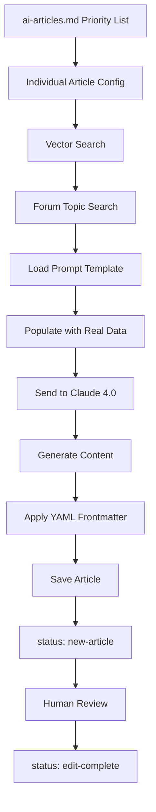

# TrainerDay AI Article Generation System

An automated system to generate TrainerDay blog articles using vector search across existing content combined with Claude 4.0 for content generation. Creates educational, factual articles based on real user questions and experiences.

## Quick Start

### Environment Setup

1. **Environment Variables** - Create `.env` file:
```env
OPENAI_API_KEY=your_openai_key_here
ANTHROPIC_API_KEY=your_anthropic_key_here
CONTENT_OUTPUT_PATH=/Users/alex/Documents/bm-projects/TD-Business/blog
DATABASE_URL=your_postgres_connection_string
```

2. **Database Setup** - PostgreSQL with pgvector extension for vector search across:
   - Blog articles
   - YouTube video transcripts  
   - Forum Q&A content

### Generate Articles

**Individual Articles** (specific solutions):
```bash
python scripts/generate_individual_article.py 1   # Generate article #1
python scripts/generate_individual_article.py 3   # Generate article #3
```

**Overview Articles** (comprehensive guides):
```bash
python scripts/generate_overview_article.py mobile-app   # Generate mobile app overview
```

## Article Priority List

The system works from priority-ordered article lists organized by category:

### Category-Specific Lists (in-progress folder)
- `in-progress/ai-articles-features.md` - **130+ Feature articles** (how-to guides, feature explanations, setup guides) - **PRIMARY FOCUS**
- `in-progress/ai-articles-issues.md` - **6 Issue articles** (problems, crashes, connection issues, bugs)
- `in-progress/ai-articles-training.md` - **26 Training articles** (workout planning, coaching advice, training methodologies)
- `in-progress/ai-articles-other.md` - **32 Other articles** (general questions, comparisons, user experience topics)
- `in-progress/ai-articles-articles.md` - **20 Overview Hub articles** (comprehensive 1800-word guides)

### Article Categories

- **Issue**: Problems, crashes, connection issues, bugs
- **Features**: How-to guides, feature explanations, setup guides, platform functionality
- **Training**: Workout planning, coaching advice, training methodologies, fitness guidance  
- **Other**: General questions, comparisons, user experience topics, miscellaneous inquiries

All articles are **priority-ordered** by recent forum activity and user impact, with the top 50 marked as "yes" for immediate generation.

### Current Focus: Features Articles

We are currently prioritizing **ai-articles-features.md** which contains 130+ feature-focused articles covering:
- TrainerDay setup and configuration guides
- Calendar and sync functionality
- Device connectivity and detection  
- Workout tracking and data management
- Training plan customization
- Export and integration workflows
- Coach Jack setup and troubleshooting

**Path:** `/Users/alex/Documents/bm-projects/TD-Business/blog/in-progress/ai-articles-features.md`

## System Architecture



## Content Generation

### Individual Articles (500-800 words)
Structure:
1. **What I've Observed** (based on provided sources)
2. **What Users Have Told Me** (actual user reports)  
3. **Solutions I Recommend** (documented solutions)
4. **When to Reach Out** (additional help framing)

### Overview Articles (800-1200 words)
Structure:
1. **Introduction** (essential coverage)
2. **Core Features** (main functionality)
3. **Getting Started** (essential setup)
4. **Key Confusion Points** (main misconceptions)
5. **Best Practices** (important tips)
6. **Integration Essentials** (connections to other tools)
7. **Conclusion** (next steps)

## Templates

- `templates/individual-article-prompt-template.txt` - Individual article prompts
- `templates/overview-article-prompt-template.txt` - Overview article prompts  
- `templates/obsidian-frontmatter-template.yaml` - YAML structure

### Writing Style

**Conversational Personal Voice**:
- Write as Alex, the founder who helps users directly
- Avoid formulaic openings like "As the founder of TrainerDay..."
- Use natural, varied openings: "This comes up...", "If your app is freezing..."
- For issues: Don't make problems sound overly common or frequent

**Tone Guidelines**:
- Calm, matter-of-fact approach to problems
- No scary/dramatic language
- Source-based content only (no invented details)
- Encouraging, solution-focused

## Quality Control

### Article Status Workflow
- `status: new-article` - Generated by AI, needs review
- `status: edit-complete` - Reviewed and approved for publication

### Content Constraints
- **ONLY** use information from provided content sources
- **DO NOT** invent steps, procedures, or technical details
- **DO NOT** make up button names, menu locations, or workflows
- Base all advice on documented user experiences

### Length Targets
- Individual articles: 500-800 words (keep concise and practical)
- Overview articles: 800-1200 words (comprehensive but focused)

## Technical Infrastructure

- **Vector Search**: OpenAI text-embedding-3-large (1536 dimensions)
- **Content Generation**: Claude 4.0 (claude-sonnet-4-20250514)  
- **Database**: PostgreSQL with pgvector extension
- **Sources**: Unified content_embeddings table (blog, youtube, forum)
- **Output**: Markdown with Obsidian-compatible YAML frontmatter

## Key Features

### Vector Search Integration
- Searches across blog articles, YouTube videos, and forum Q&A
- Finds relevant existing content for each article topic
- Ensures generated content is grounded in real TrainerDay documentation

### Forum Integration  
- Pulls specific forum topics related to user questions
- Includes real user quotes and experiences
- Addresses actual confusion points from community discussions

### Multi-Article Types
- **Individual solutions**: Target specific user problems
- **Overview guides**: Comprehensive coverage linking to related articles
- **Different engagement levels**: Quick fixes, complete guides, technical deep-dives

## Output Structure

Generated articles include:
- **YAML frontmatter** with category, tags, engagement level
- **Structured content** with clear headings
- **Real user quotes** from forum discussions  
- **Source-based solutions** only
- **Clear next steps** and support contact information

## Files & Directories

```
td-blog-ai/
├── scripts/
│   ├── generate_individual_article.py    # Individual article generator
│   └── generate_overview_article.py      # Overview article generator
├── templates/
│   ├── individual-article-prompt-template.txt
│   ├── overview-article-prompt-template.txt
│   └── obsidian-frontmatter-template.yaml
├── utils/
│   └── db_connection.py                   # Database utilities
├── session.md                             # Development session notes
└── README.md                              # This file

Article lists are located in:
/Users/alex/Documents/bm-projects/TD-Business/blog/in-progress/
├── ai-articles-features.md               # Features category (130+ articles) - PRIMARY FOCUS
├── ai-articles-issues.md                 # Issue category (6 articles)
├── ai-articles-training.md               # Training category (26 articles)
├── ai-articles-other.md                  # Other category (32 articles)
└── ai-articles-articles.md               # Overview Hub articles (20 articles)
```

## Usage Examples

**Generate first 5 priority articles**:
```bash
for i in {1..5}; do python scripts/generate_individual_article.py $i; done
```

**Generate mobile app overview**:
```bash
python scripts/generate_overview_article.py mobile-app
```

**Working with Features Articles**:
The primary focus is on `ai-articles-features.md` which contains articles numbered by priority. To generate features articles:
```bash
# Generate top priority features articles (articles #5, #6, #10, etc. from features list)
python scripts/generate_individual_article.py 5   # Coach Jack Setup Guide
python scripts/generate_individual_article.py 6   # Calendar App vs Website Differences  
python scripts/generate_individual_article.py 10  # Cadence Setup Guide
```

Generated articles will be saved to `$CONTENT_OUTPUT_PATH/articles-ai/` with status `new-article` for review.

## Database Schema

```sql
-- Unified content embeddings table
CREATE TABLE content_embeddings (
    id SERIAL PRIMARY KEY,
    source VARCHAR(20) NOT NULL,        -- 'forum', 'blog', 'youtube', 'project_feature_map'
    source_id VARCHAR(100) NOT NULL,    -- topic_id, article_filename, video_id
    title TEXT NOT NULL,
    content TEXT NOT NULL,              -- The actual text content for retrieval
    embedding vector(1536) NOT NULL,    -- OpenAI text-embedding-3-large
    metadata JSONB,                     -- source-specific fields
    chunk_index INTEGER DEFAULT 0,     -- for multi-chunk content
    created_at TIMESTAMP DEFAULT NOW(),
    UNIQUE(source, source_id, chunk_index)
);
```

## Article Priority Management

The article priority lists (located in `in-progress/` folder) contain:

| Column | Purpose |
|--------|---------|
| # | Priority order (1 = highest priority) |
| Include | `yes`/`later`/`no` - Controls which articles to generate |
| Article Title | Generated article title |
| Category | `Issue`/`Features`/`Training`/`Other` |
| Engagement | `Quick`/`Complete`/`Geek-Out` - Determines article length |
| Tags | Content categorization tags |
| User Question/Pain Point | Original user problem that sparked the article |

## Quality Improvements

### Recent Enhancements (July 2025)
1. **Personal Voice**: Articles now written from Alex's personal perspective as founder
2. **Natural Openings**: Varied, conversational beginnings instead of formulaic introductions
3. **Issue Tone**: Problems described calmly without making them sound overly common
4. **Source Constraints**: Strict guidelines prevent AI from inventing details
5. **Length Control**: Explicit word count targets for each engagement level

### Content Validation
- All technical information must come from existing sources
- No invented procedures, button names, or workflows
- Real user quotes from forum discussions
- Calm, helpful tone for problem resolution

## Content Strategy

The system generates articles based on real user questions and forum activity, ensuring content addresses actual user needs rather than generic topics. Articles are designed to:

1. **Solve specific problems** users encounter
2. **Link to related solutions** through overview articles
3. **Maintain brand voice** with personal, helpful tone
4. **Scale efficiently** while maintaining quality
5. **Support SEO** through targeted keywords and internal linking

## Integration with TrainerDay Ecosystem

This system integrates with:
- **Forum Analysis System**: `forum-scraper-trainerday/`
- **Vector Database**: Shared PostgreSQL with pgvector extension
- **Content Strategy**: TD-Business Basic Memory project planning documents
- **Existing Blog**: 69+ articles already processed and embedded

**Goal**: Create 200+ high-quality, user-driven blog articles that systematically address every major user question and feature in the TrainerDay ecosystem.

For detailed development notes and testing history, see `session.md`.