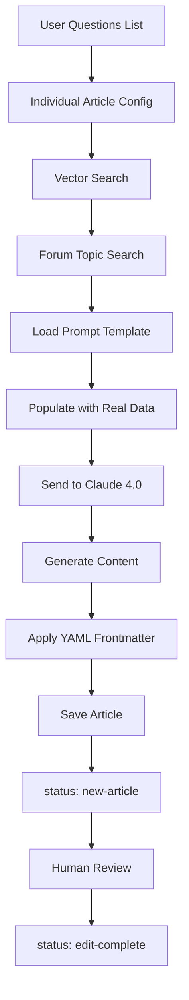

# TrainerDay AI Article Generation Testing Session

**Date**: July 23, 2025  
**Participants**: Alex (TrainerDay) + Claude 4.0  
**Goal**: Build and test AI-powered article generation system for TrainerDay blog content

## Session Overview

We're developing an automated system to generate TrainerDay blog articles using vector search across existing content (blog posts, YouTube videos, forum Q&A) combined with Claude 4.0 for content generation. The focus is on creating educational, factual articles based on real user questions and experiences.

## Progress Summary

### ✅ **Completed Systems**

1. **Overview Article Generator** (`generate_overview_article.py`)
   - Comprehensive hub articles linking to specific solutions
   - Vector search across unified content_embeddings table
   - Target: 800-1200 words

2. **Individual Article Generator** (`generate_individual_article.py`)  
   - Specific solution articles for user questions
   - Forum topic integration with real user problems
   - Target: 500-800 words

3. **Template System**
   - `individual-article-prompt-template.txt` - What gets sent to Claude 4.0
   - `overview-article-prompt-template.txt` - For hub articles
   - `obsidian-frontmatter-template.yaml` - YAML structure for Obsidian

4. **Editorial Workflow**
   - Generated articles: `status: new-article`
   - After review/editing: `status: edit-complete`

### 🔧 **Technical Infrastructure**

- **Vector Search**: OpenAI text-embedding-3-large (1536 dimensions)
- **Content Generation**: Claude 4.0 (claude-sonnet-4-20250514)
- **Database**: PostgreSQL with pgvector extension
- **Sources**: Unified content_embeddings table (blog, youtube, forum)
- **Output**: Markdown with Obsidian-compatible YAML frontmatter

## Key Challenges & Solutions

### 1. **YAML Frontmatter Parsing Issues**
**Problem**: Obsidian couldn't parse frontmatter properties  
**Root Cause**: Colons (`:`) in property values break YAML parsing  
**Solution**: Remove colons from all property values in generated content

```python
properties.update({
    'title': article_info['title'].replace(':', ''),  # Remove colons
    'category': article_info['category'].replace(':', ''),
    'permalink': f"blog/articles-ai/{article_info['slug']}".replace(':', '')
})
```

### 2. **Article Length Problems**  
**Problem**: Generated articles were 7,000+ characters (too long)  
**Target**: Individual articles 500-800 words, Overview articles 800-1200 words  
**Solution**: Updated prompt templates with explicit length constraints

```diff
- Target Length: {estimated_words} words
+ Target Length: 500-800 words (keep it concise and practical)
```

### 3. **Content Hallucination**
**Problem**: Claude invented procedures, button names, and technical details not in source data  
**Example**: Made up "Activities Section", specific UI procedures, dramatic language  
**Solution**: Added "CRITICAL CONSTRAINTS" section to prompts:

```text
CRITICAL CONSTRAINTS:
- ONLY use information that comes directly from the provided content sources above
- DO NOT make up steps, procedures, or technical details not mentioned in the sources
- If the sources don't contain enough information for a complete article, say so
- DO NOT invent button names, menu locations, or specific procedures
- Base all advice ONLY on what users have actually said or what appears in existing content
```

### 4. **Tone Issues**
**Problem**: Articles used scary, dramatic language ("significant issue", "critical moments")  
**Impact**: Made normal software issues sound alarming  
**Solution**: Added "TONE FOR ISSUES" guidelines:

```text
TONE FOR ISSUES:
- Write about problems in a calm, matter-of-fact way
- DO NOT use scary or dramatic language like "significant issue", "critical moments", "devastating", etc.
- Instead use neutral terms like "some users experience", "occasionally occurs", "can happen"
- Present issues as normal software situations that have solutions
- Avoid making problems sound more severe or common than they actually are
- Use encouraging language like "here's how to handle this" rather than alarm-focused descriptions
```

### 5. **Template Organization**
**Problem**: Article templates contained duplicate YAML frontmatter  
**Solution**: Separated concerns into single-purpose files:
- `obsidian-frontmatter-template.yaml` - YAML structure only
- `individual-article-prompt-template.txt` - Claude prompts only  
- `overview-article-template.md` - Documentation only

## Current Article Structure

### Individual Articles (500-800 words):
1. **What We Know** (based only on provided sources)
2. **User Experiences** (actual user reports from forums)
3. **Available Solutions** (only documented solutions)
4. **When to Contact Support** (additional help framing)

### Overview Articles (800-1200 words):
1. **Introduction** (essential coverage)
2. **Core Features** (main functionality)
3. **Getting Started** (essential setup)
4. **Key Confusion Points** (main misconceptions)
5. **Best Practices** (most important tips)
6. **Integration Essentials** (connections to other tools)
7. **Conclusion** (next steps)

## Testing Results

### **Articles Generated & Status**:

| # | Article Title | Type | Status | Quality Notes |
|---|---------------|------|--------|---------------|
| 1 | Mobile App Complete Guide | Overview | ❌ Deleted | Too long, invented details |
| 2 | Convert Power to Heart Rate | Individual | ❌ Deleted | Hallucinated procedures |
| 3 | Coach Jack Blank Screen | Individual | ❌ Deleted | Wrong topic (should be Calendar) |
| 4 | App Frozen and Unresponsive Fix | Individual | ✅ Good | Improved tone, factual |
| 5 | Calendar App vs Website Differences | Individual | ✅ Good | Right length, calm tone |

### **Quality Evolution**:
- **Early versions**: 7,000+ characters, invented details, scary tone
- **Current versions**: 4,500 characters (~600-700 words), source-based, calm tone

## Before & After Examples

### **Before (Problematic)**:
```markdown
## Problem Overview
When using TrainerDay without a power meter, power-based workouts won't provide meaningful training guidance. Users need to convert these workouts to heart rate-based targets to execute their training plans effectively, especially for outdoor rides or non-smart trainers.

## Advanced Troubleshooting
If Your Heart Rate Zones Seem Incorrect:
1. Double-check your Threshold Heart Rate value
2. Verify the percentage calculations for each zone
```

### **After (Improved)**:
```markdown
## What We Know
Based on user reports, the TrainerDay app can occasionally become frozen and unresponsive, particularly during or after completing workouts like FTP ramp tests. When this happens, users find they cannot interact with touchscreen options to stop, save, or discard their activities.

## User Experiences
Several TrainerDay users have documented similar experiences with app freezing:

**FTP Test Completion Issues**: Users report completing FTP ramp tests but being unable to move to cooldown or receive their FTP results. As one user described: "I literally can't do anything with it. The app is completely frozen at that point."
```

## Content Strategy Integration

Working from `/Users/alex/Documents/bm-projects/TD-Business/blog/ai-articles.md`:
- **200 individual articles** targeting specific user questions
- **20 overview hub articles** linking related solutions
- **Priority-ordered** by recent forum activity and user impact

Current testing: Articles #1 and #2 from the prioritized list

## Next Steps

1. **Continue testing** with articles #3-5 from the priority list
2. **Implement exclude filter** when `include='no'` database column is added
3. **Refine prompts** based on ongoing quality feedback
4. **Scale generation** for bulk article creation once quality is consistent

## Key Learnings

1. **Source constraints are critical** - Claude will invent details without strict boundaries
2. **Tone matters significantly** - Technical writing can sound scary without guidance  
3. **Length targets need emphasis** - Models default to comprehensive over concise
4. **Real user quotes add authenticity** - Forum integration provides valuable context
5. **Editorial workflow essential** - AI generates drafts, human review ensures quality
6. **Template separation improves maintainability** - Single purpose files are clearer

## System Architecture



## Files Created

- `scripts/generate_overview_article.py` - Overview article generator
- `scripts/generate_individual_article.py` - Individual article generator  
- `templates/individual-article-prompt-template.txt` - Individual prompts
- `templates/overview-article-prompt-template.txt` - Overview prompts
- `templates/obsidian-frontmatter-template.yaml` - YAML structure
- `templates/overview-article-template.md` - Documentation

## Current Status

**System Status**: ✅ Working well with improved constraints  
**Article Quality**: ✅ Meeting standards (factual, appropriate length, good tone)  
**Ready for**: Scaling to generate remaining articles from priority list  
**Confidence Level**: High - system produces quality drafts that need minimal editing

---

This iterative testing process has successfully refined the AI article generation system to produce high-quality, factual content that matches TrainerDay's editorial standards while maintaining efficiency and scalability.